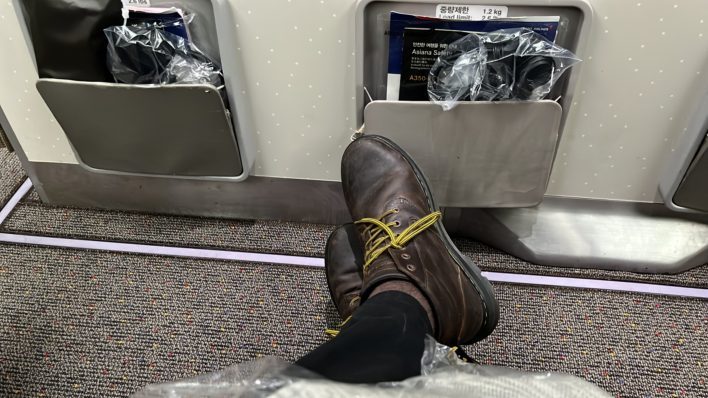

# Some Context
Travelling is often hard and stressful. Travelling while disabled involves all sorts of other barriers, points of friction, and uncertainties. Consequently it can be hard and stressful in different and additional ways. I've been thinking for a while about recording some of my experiences with travel. I can walk, but get tired quite quickly. Many airports are fairly large, and the amount of walking, often with bags, can tire me out before I reach my destination.

I started using airport assistance in Sweden around 10 years ago, after tearing ligaments in my knee at the end of a long post-conference night out. This minor calamity was fortuitous in the long run: it forced me through some probably pretty ableist reservations about getting help through airports. Now I get wheelchair assistance. My travel experience has improved a lot since then, since this allows me to conserve energy for the things that I want to do.

 I sometimes fall between the gaps where accessibility is concerned. I don't use a chair—either manual or powered—but my walking isn't typical, and I get tired. Most access measures don't really get at what I need, which isn't a chair, but rather occasional transport of some kind, regular breaks, and readily available seating. In general, I usually muddle together a personal system comprised of good planning, public transport, a timetable that accounts for breaks, and (recently) a collapsible stool.

I recently made the longest journey I've taken for around 20 years for a 2-week-long holiday in Seoul. I thought it would be interesting, and possibly helpful, to record some reflections on this trip. Note that this post will be less a general story about disability and access in Seoul—though it will include some of that—and more one person's somewhat idiosyncratic experience of navigating this journey.

# Dublin and Heathrow Airport
I've had somewhat mixed experiences with assistance through Dublin Airport.[^1] In general, it has been satisfactory—waiting times have been acceptable, the process seems well-managed, and the assistants have been friendly and helpful—but I've also had a couple of bad encounters.[^2] In this case, I had a short wait, and was brought briskly through the airport to an area near to our gate. The flight from Dublin to Heathrow was pretty unremarkable.

When we arrived in Heathrow, I was met off the plane, collected my luggage, and was brought onwards to the Asiana Airlines desk. When Asiana opened, staff told us we had been allocated different seats at the front of our section with a lot of legroom. I have no idea if this was simple good fortune, or because I had requested assistance. From this point until boarding the Incheon flight, my travel companion took over pushing the chair. This is usually an option (and one that some assistance providers seem to nudge travellers towards, perhaps to take the job off their hands).
# Flying from London to Seoul
The extra legroom was great, but came at a cost. We had to keep our cabin bags in the overhead compartment, and couldn't easily get at reading lights. The crew turned out the lights pretty soon into the flight (they basically put us to bed), so we didn't have much option but to try to sleep. And while the seats were spacious, they weren't comfortable enough to get decent sleep during a 13 hour overnight flight.

The Asiana cabin crew were extremely polite and helpful. Near the end of the flight, they came to tell me they would bring me to assistance upon landing. I found this really positive and reassuring. In my experience, cabin crew don't say anything unless you approach them to ask about the next stage of assistance, and even then this doesn't seem like something they have at their fingertips. This leaves you feeling a bit unsure about what will happen next. This more active approach is very reassuring.

# At Incheon Airport
The assistant was prompt and polite, and did his best with limited English to create some conversation (with two phrases of Korean, we were no use whatsoever). He did do one weird and not very welcome thing. Security requires that you put multiple fingers on a scanner concurrently, and I struggled to arrange myself at an angle that would allow this to happen. The assistant decided to help by grabbing my fingers and gamely trying to contort them into a configuration that the scanner could read. This didn't met the requirements of either me or the scanner. The operator and I managed to get a reading after a few attempts.

# Back at Incheon
Jump forward to the return trip. At Incheon, I was informed that I should go to the desk of our return airline (Air Korea) for assistance. This is one big discrepancy between how most European airports handle assistance, and the way that South Korea seems to do so. In all my experiences so far, while you request assistance when you book your flights, this isn't managed by the airline, but by the airport (or, rather, a company that the airport has contracted to handle assistance). This means that regardless of who you are flying with, you go to the same place for assistance, and are helped by people who work for the same company.

The Korean airlines, by contrast, seem to handle the assistance themselves. And we saw some weaknesses of this approach on this return journey. The Air Korea area had a few desks, one of which seemed to serve as a regular desk  and bag check, as well as the assistance desk. When we went straight to the area with the disability symbol over it—as you would do in any airport if you've requested assistance—we were told to go to the back of the queue. After a bit of confusion, I went back to the desk and asked: 'if this is Assistance, why am I queueing along with non-Assistance passengers?' For me, queuing is the opposite of accessibility (and I was by now exhausted after 12 days of walking). The staff didn't have any satisfactory answer. I was told something like 'I'm sorry, this is just how it is, you  need to queue with the others'.

When we made it to the front, we were passed along to another desk where some wheelchairs were placed. When I made to sit on one, I was told by another staff member that these were for assistance passengers only. After clearing this up, we again opted to do the next step of the trip with the chair, but by ourselves. Staff were much more helpful at the gate. We were brought close to the plane ahead of time, and given priority boarding.
# Flying from Incheon to London 
We had regular seats, and on balance, this was much better. They were still roomy enough, and we had our luggage at our feet. The cabin crew still insisted on lights out, but I managed to watch two films and read half a book. As before, someone came over near the end of the flight to discuss disembarkation. Again, I was very reassured by this.
# Heathrow Terminals 2 and 4
The reassurance was misplaced. This was probably the worst part of the journey. We arrived at Terminal 4, and our next flight was from Terminal 2.  I was met off the plane and brought to an assistance 'waypoint' where we were told that while there is a help bus between terminals, there is only one driver, who is currently on a break. We had around 90 minutes at this stage to get to T2, drop off our bags, clear security, and go to the gate. Staff instead asked if I could take the Elizabeth Line. This wasn't an option: I was already tired, we had heavy bags, and above all, I had requested, and thus was justified to expect, assistance. I appreciate that time wasn't ideal, but the problem here was that there was no bus readily available to take us. In the end, we took a taxi.

When we arrived at the assistance desk in T2, we were told that we should have have checked our bags before coming there. I replied that 'dropping off bags is surely part of assistance'. We ended up taking a chair and doing the rest of the Heathrow journey ourselves.
# Final Thoughts

[^1]: I haven't mentioned every aspect of the journey, only the parts that are worth mentioning.

[^2]: Once, I was left in a pretty grim room somewhere in the bowels of the airport until someone else came to fetch me. This points out a general discrepancy between airport assistance: some airports have multiple assistance points and waiting areas dotted through the airport. This means disabled travellers can, say, get through security and still have a staffed waiting area to use as a base while they wait for their gate to be announced. In good airports, these points are located near cafes, and are in public spaces. On another occasion, no one met me off the plane. I spent some time trying to contact assistance, which turned out to be not easy. The assistance staff member did eventually appear, told me that he had been waiting, and that I had missed him because I exited via the wrong door. Unfortunately for him, I was travelling with someone who exited out that other door, and confirmed that the assistance was not there.